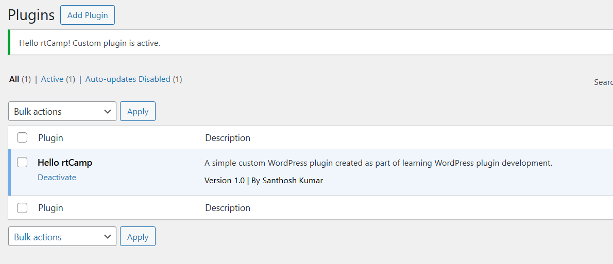

# wp-hello-rtcamp
# Hello rtCamp – WordPress Plugin

A simple WordPress plugin created to understand:
- Plugin structure
- Action hooks
- Admin notices
- Basic WordPress security checks
## Testing

- Tested locally using WordPress (Local WP)
- Plugin activates successfully and displays an admin notice

### Plugin Activated (Local Testing)

This project is part of my preparation for WordPress-focused backend roles.
